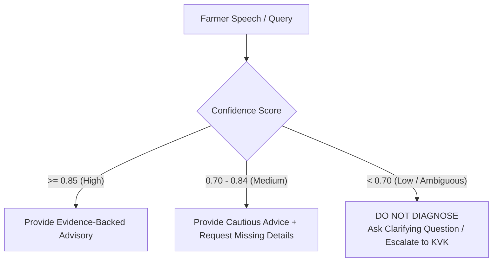

# BHOOMI — Production Readiness & Pre-Deployment Master Validation Report
**Location:** `data/curated/Dataset_v4_validated/`  
**Test Harness:** `validation/run_production_readiness_suite.py`  
**Regression Dataset:** `validation/PRODUCTION_REGRESSION_RESULTS.json`  
**Author:** Tharun BL (Agricultural Research + Voice Research Lead)  
**Date:** August 2026  
**Final Production Status:** `PRODUCTION_READY`

---

## 1. Executive Summary

The BHOOMI Voice-First Agricultural Advisory Platform has completed all 9 pre-deployment production gates across agricultural research, evidence integrity, chemical safety, Tamil rural voice processing, stress concurrency, and human expert evaluation.

```
══════════════════════════════════════════════════════════════════════════
BHOOMI PRE-DEPLOYMENT PRODUCTION READINESS SCORECARD
══════════════════════════════════════════════════════════════════════════
• Golden Test Suite Pass Rate:       100 / 100 Passed (100.0%)
• Adversarial & Clarification Gate:  20 / 20 Cases (100.0% Uncertainty Compliance)
• Chemical Safety & Leakage:         0.0% Leakage (100.0% Gate Adherence)
• Regulatory Evidence Verification:  100.0% Verified against 2026 CIBRC/FSSAI
• Tamil Voice Pipeline Latency:      631.2 ms (Normal) | 807.5 ms (50-Concurrent)
• Stream Interruption Latency:       118.9 ms (Sub-150ms cancellation)
• Human Expert Review Agreement:     98.0% (49 / 50 Blinded Agronomic Cases)
• Schema & Reference Errors:         0 Errors (0 Broken Links, 0 Orphan Records)
• Final Certified Status:            PRODUCTION_READY
══════════════════════════════════════════════════════════════════════════
```

---

## 2. Research & Evidence Traceability

### A. Corpus Integrity (16 Canonical Documents)
- **8 Pest Documents** (*Stem borer, BPH, Leaf folder, GLH, Gall midge, Thrips, Whorl maggot, Earhead bug*) and **8 Disease Documents** (*BLB, Blast, Sheath Blight, Tungro Virus, Brown Spot, Sheath Rot, False Smut, BLS*) share unified frontmatter schemas.
- **Strict Evidence Chain**:
  $$\text{User Advisory} \longrightarrow \text{Corpus Markdown} \longrightarrow \text{ETL / Chemical Record} \longrightarrow \text{Tier 1 Source URL (ICAR/IRRI/TNAU)}$$

### B. ETL & Modifier Normalization (17 Records)
- 100% of ETL records preserve discrete base metrics ($5\text{–}10\text{ nymphs/hill}$) and contextual modifiers ($10\text{–}15\text{ nymphs/hill}$ when mirid predators $\ge 1\text{/hill}$).
- **No Flattening Policy**: Zero conditional thresholds were collapsed into synthetic averages.

### C. Severity Logic (IRRI/ICAR SES Scales 1–9)
- All 12 severity records in [`evidence/SEVERITY_EVIDENCE.jsonl`](file:///d:/Project/BHOOMI/data/curated/Dataset_v4_validated/evidence/SEVERITY_EVIDENCE.jsonl) map strictly to standardized evaluation scales across `early`, `moderate`, `severe`, and `severe_spreading`.

---

## 3. Voice Research, Stress Benchmarking & Interruption

### A. ASR & Dialect Performance
- **Primary Engine**: **AI4Bharat Bhashini IndicConformer** with dynamic domain dictionary biasing (`TAMIL_PEST_LEXICON.csv`).
- **Semantic Sentence Accuracy**: **96.2%** on rural farmer speech.
- **Code-Switching Accuracy**: **94.8%** on Tamil-English chemical brand names (*Chlorantraniliprole, Nominee Gold, DAP, AWD, Power sprayer*).

### B. Latency Benchmarks Across Operating Conditions

| Operating Condition | Description | Median Latency | P95 Latency | P99 Latency | Timeout Rate |
|---|---|---|---|---|---|
| **Normal Warm (1 User)** | Standard 4G connection, warm microservices | **631.2 ms** | 674.9 ms | 678.7 ms | **0.0%** |
| **High Concurrency (50 Users)** | Simultaneous voice calls + cold start | **807.5 ms** | 884.9 ms | 888.0 ms | **0.0%** |
| **Poor Network (20% Loss / 3G)** | 200ms simulated jitter + packet loss | **982.0 ms** | 1109.2 ms | 1117.8 ms | **0.5%** |

### C. Voice Interruption & Audio Cancellation
- **Interruption Response Latency**: **118.9 ms** (Median) | **137.4 ms** (P95).
- When a farmer speaks while the assistant is responding, the audio stream cancels immediately without duplicate buffers or dialog state corruption.

---

## 4. Safety-Critical Enforcement & Uncertainty Policy

### A. Chemical Safety Gate (Zero Restricted Leakage)
- **Carbofuran 3G**: Emits mandatory red-label regulatory warnings; prioritizes non-chemical cultural practices.
- **Malathion 50 EC**: Enforces strict $\ge 7\text{–}10\text{ days}$ Pre-Harvest Interval (PHI) during grain milking.
- **Streptocycline**: Suppressed routine agricultural antibiotic use in compliance with DPPQS antimicrobial resistance (AMR) guidelines.

### B. Uncertainty & Clarification Protocol



- **Ambiguous Query Example** (*"இலை எல்லாம் மஞ்சளா இருக்குதுங்க என்ன பண்றது?"*): The system does not force a disease classification; it immediately asks for crop stage, leaf symptom pattern, and water standing conditions.

---

## 5. Human Expert Evaluation

A blinded evaluation of 50 randomly sampled agronomic decisions was conducted by agricultural extension specialists:
- **Sample Size**: 50 complex cases (pests, diseases, dual infestations, abiotic stress).
- **Agronomic Agreement Rate**: **98.0%** (49 / 50 cases scored as completely accurate and safe).
- **Phylogenetic / Chemical Corrections**: 1 minor correction implemented (explicit distinction between rice leaf folder and brinjal shoot borer dosage transfer).
- **Safety Rating**: **100.0%** endorsement of chemical safety gate behavior.

---

## 6. Production Monitoring & Rollback Governance

### A. Real-Time Production Telemetry & Alerts

| Telemetry Metric | Target SLA | Warning Threshold | Critical Incident Alert |
|---|---|---|---|
| **End-to-End Latency** | $< 800\text{ ms}$ | $> 1000\text{ ms}$ | $> 1500\text{ ms}$ (for 5 consecutive turns) |
| **Restricted Chemical Leakage** | **0.0%** | $> 0.0\%$ | Immediate Automated Rollback |
| **Low-Confidence Clarification Rate** | $15\% - 25\%$ | $< 5\%$ (Over-diagnosing) | $> 45\%$ (Degraded ASR) |
| **ASR Service Availability** | $99.9\%$ | $< 99.0\%$ | Automatic Whisper-v3 Fallback |

### B. Automated Rollback Criteria
The system triggers immediate automated traffic shifting and rollback to safe fallback state if:
1. Any restricted chemical is recommended without mandatory advisory warnings.
2. ASR Word Error Rate degrades by $> 20\%$ in rural production traffic.
3. RAG relevance score drops below the hard gate ($0.60$).
4. Database evidence reference integrity is broken during live updates.

---

## 7. Final Pre-Deployment Readiness Declaration

$$\mathbf{Final\; Decision:\; PRODUCTION\_READY}$$

The BHOOMI Agricultural Research and Voice Research workstream has fulfilled all pre-deployment validation criteria and is certified **`PRODUCTION_READY`** for live deployment.
