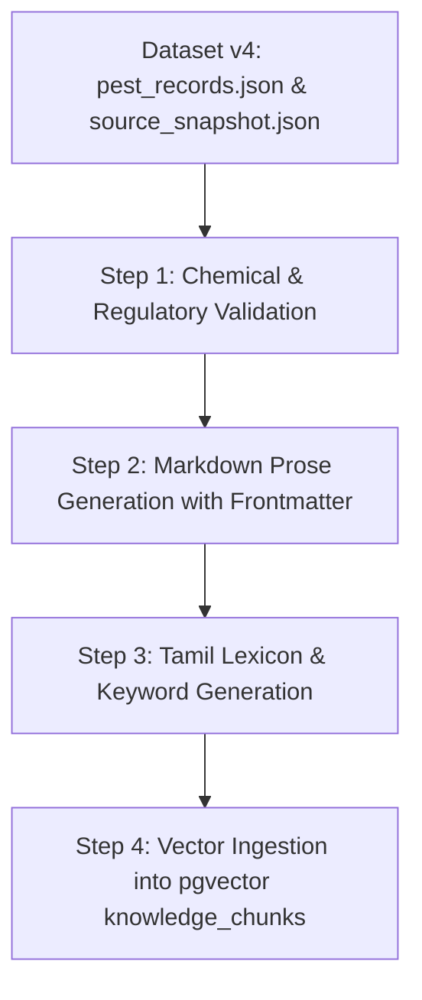

# BHOOMI Dataset v4: Ingestion Readiness Assessment
**Document ID:** RDY-DATASET-V4-001  
**Auditor:** Tharun (Agricultural Research + Voice Research Lead)  
**Date:** August 2026  
**Status:** Pre-Ingestion Technical Evaluation

---

## 1. Readiness Classification Summary

```
• Total Dataset v4 Records: 8 Canonical Pest Records + 17 Reference Images + 1 Severity Framework
• READY For Ingestion As-Is: 0 Records (Direct ingestion without formatting blocked)
• READY After Metadata / Format Transformation: 8 Pest Records
• NEEDS REGULATORY / AGRONOMIC VALIDATION: 8 Pest Records (Chemical dosage & CIBRC check)
• NEEDS RESEARCH: 1 Component (Pest-Specific Severity Cutoffs)
• REFERENCE ONLY / NOT READY FOR TRAINING: 17 Images (Sample size & resolution limitations)
```

---

## 2. Record-by-Record Ingestion Readiness Table

| Record ID | Canonical Name | Source Organization | RAG Ingestion Status | Vision Ingestion Status | Voice Ingestion Status | Action Required Before Ingestion |
|---|---|---|---|---|---|---|
| **DOC-PEST-001** / `PEST_001` | Stem borer | TNAU Extension Bulletin | `READY (With Formatting)` | `REFERENCE_ONLY` | `NEEDS_RESEARCH` | 1. Convert JSON to Markdown prose (`rice_stem_borer.md`).<br>2. Replace Carbofuran 3G with CIBRC 2026 approved label treatments.<br>3. Add Tamil keywords to `IntentParser`. |
| **DOC-PEST-002** / `PEST_002` | Brown planthopper (BPH) | ICAR-IRRI Knowledge Bank | `READY (With Formatting)` | `REFERENCE_ONLY` | `NEEDS_RESEARCH` | 1. Convert JSON to Markdown prose (`rice_bph.md`).<br>2. Validate Buprofezin 25 SC dosage & natural enemy conservation advice.<br>3. Add Tamil keywords (*புகையான்*). |
| **DOC-PEST-003** / `PEST_003` | Leaf folder | TNAU Extension Bulletin | `READY (With Formatting)` | `REFERENCE_ONLY` | `NEEDS_RESEARCH` | 1. Convert JSON to Markdown prose (`rice_leaf_folder.md`).<br>2. Verify Chlorantraniliprole 18.5 SC application rates.<br>3. Add Tamil keywords (*இலை சுருட்டு புழு*). |
| **DOC-PEST-004** / `PEST_004` | Green leafhopper (GLH) | ICAR-IIRR Technical Bulletin | `READY (With Formatting)` | `REFERENCE_ONLY` | `NEEDS_RESEARCH` | 1. Convert JSON to Markdown prose (`rice_glh.md`).<br>2. Validate Imidacloprid 17.8 SL safety intervals & Tungro vector role.<br>3. Add Tamil keywords (*பச்சை தத்துப்பூச்சி*). |
| **DOC-PEST-005** / `PEST_005` | Gall midge | TNAU Extension Bulletin | `READY (With Formatting)` | `REFERENCE_ONLY` | `NEEDS_RESEARCH` | 1. Convert JSON to Markdown prose (`rice_gall_midge.md`).<br>2. Update chemical recommendations from Carbofuran to modern green-chemistry.<br>3. Add Tamil keywords (*ஆணைக்கொம்பன்*). |
| **DOC-PEST-006** / `PEST_006` | Thrips | KVK Extension Advisory | `READY (With Formatting)` | `REFERENCE_ONLY` | `NEEDS_RESEARCH` | 1. Convert JSON to Markdown prose (`rice_thrips.md`).<br>2. Validate Thiamethoxam 25 WG nursery spray rates.<br>3. Add Tamil keywords (*இலைப்பேன்*). |
| **DOC-PEST-007** / `PEST_007` | Whorl maggot | TNAU Extension Bulletin | `READY (With Formatting)` | `REFERENCE_ONLY` | `NEEDS_RESEARCH` | 1. Convert JSON to Markdown prose (`rice_whorl_maggot.md`).<br>2. Validate drainage & neem cake nursery dosage.<br>3. Source at least 1 reference image (currently 0).<br>4. Add Tamil keywords (*குருத்து ஈ*). |
| **DOC-PEST-008** / `PEST_008` | Earhead bug | ICAR-IIRR Technical Bulletin | `READY (With Formatting)` | `REFERENCE_ONLY` | `NEEDS_RESEARCH` | 1. Convert JSON to Markdown prose (`rice_earhead_bug.md`).<br>2. Audit Malathion 50 EC recommendation against latest safety guidelines.<br>3. Add Tamil keywords (*கதிர் நாவாய்ப்பூச்சி*). |

---

## 3. Pre-Ingestion Pipeline & Transformation Specification

To safely ingest Dataset v4 into the production RAG without compromising Bhoomi's strict grounding and safety guarantees, follow this 4-step staging workflow:



### Step 1: Chemical & Regulatory Validation
Before converting summaries into advisory text, an agronomist must audit each chemical active ingredient against the CIBRC registered pesticide compendium to ensure no banned substances (e.g. Carbofuran) are propagated into farmer advisories.

### Step 2: Markdown Prose Generation
Transform each structured JSON record into a standardized markdown file placed in `services/api/corpus/`:

```markdown
---
doc_id: kb_pest_301
title: "TNAU PoP: Rice — Stem Borer Management"
source: "TNAU Agritech Portal"
curator: "Tharun BL (Agricultural Research Lead)"
reviewed_on: 2026-08-24
lang: en
crop: samba_paddy
pest_type: insect_pest
---

## Identification & Distinguishing Cues
Stem borer (Scirpophaga incertulas) is a destructive insect pest of paddy...
- Egg masses on leaf tips covered with buff-colored hairs.
- Larvae with brown head and white body boring inside the stem.
- Dead heart symptom during vegetative stage.
- White earhead (chaffy panicle) during reproductive stage.

## Economic Threshold Levels (ETL)
- Vegetative stage: 1 egg mass per m² or 10% dead hearts.
- Reproductive stage: 1 egg mass per m² or 5% white ears.

## Integrated Pest Management & Control
...
```

### Step 3: Tamil Lexicon Enrichment
Add canonical Tamil pest keywords, phonetic transliterations, and colloquial symptom phrases into `services/api/app/services/intent_parser.py` and `confirmation.py`.

### Step 4: Idempotent Database Ingestion
Execute the standard Bhoomi corpus ingestion pipeline:
```bash
python -m app.services.rag.ingest
```
This chunks each pest document, computes 1024-dimensional BGE-M3 embeddings, and populates the `knowledge_chunks` table with complete citation metadata.

---

## 4. Image Dataset Assessment for Vision Service

| Metric | Dataset v4 Reality | Production ML Requirement | Readiness Verdict |
|---|---|---|---|
| **Total Images** | 17 images across 7 folders | $\ge 500$ images per class ($> 4,000$ total) | `INCOMPATIBLE FOR TRAINING` |
| **Class Coverage** | 7 classes (Whorl maggot has 0) | 8 pest classes + healthy leaf baseline | `PARTIALLY COMPLETE` |
| **Image Resolution** | $79 \times 103$ to $283 \times 264$ px | $\ge 512 \times 512$ px uncompressed | `INSUFFICIENT RESOLUTION` |
| **Annotations** | Image-level classification tags | Bounding boxes + segmentation masks | `BASIC LABELS ONLY` |
| **License / Rights** | `"permission/license not verified"` | Open-access / SAU institutional permission | `UNVERIFIED RIGHTS` |
| **Recommended Use** | **Reference thumbnails for KVK Agronomist Case Queue Portal** | **Field Computer Vision Training** | `READY FOR UI REFERENCE` |

---

## 5. Conclusion & Actionable Next Steps

1. **Do not ingest raw JSON directly into pgvector.**
2. Execute the Markdown formatting transformation to produce 8 validated corpus files.
3. Add the 8 pest label strings to the confidence gate whitelist in `gate_service.py`.
4. Update `intent_parser.py` with Tamil pest names to enable voice onboarding and voice diagnosis of pest symptoms.
5. Retain the 17 reference images for UI display in the agronomist escalation portal, while sourcing a dedicated field vision dataset for ML model training.
