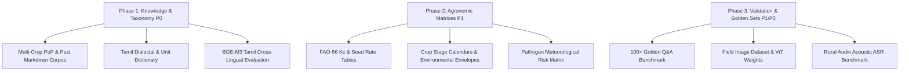

# Agricultural & Voice Research Gaps: Prioritized Deliverables
**Bhoomi SIH25076 Platform**
**Author / Responsible Lead:** Tharun (Agricultural Research + Voice Research)
**Target:** SIH25076 Production Readiness & SIH26131 Realignment

---

## 1. Prioritization Framework

- **P0 (Critical Blocker)**: Core domain data or models without which RAG retrieval, vision diagnosis, or Tamil voice comprehension immediately fails or falls back to synthetic stubs.
- **P1 (High Priority)**: Quantitative agronomic matrices required for deterministic scoring accuracy, FAO-56 resource planning, and proactive early-warning outbreak triggers.
- **P2 (Quality & Polish)**: Linguistic edge cases, field robustness benchmarks, multi-turn dialogue refinements, and regulatory compliance reviews.

---

## 2. Prioritized Research Gaps & Deliverables

| Priority | Missing / Weak Area | Existing Evidence in Codebase | What Tharun Must Provide | Source Required | Validation Required |
|---|---|---|---|---|---|
| **P0** | **Multi-Crop Knowledge Corpus (PoP)** | Only 8 paddy/rice documents exist in `services/api/corpus/` and `app/services/rag/corpus_data.py`. Non-paddy queries return zero chunks and trigger `insufficient_context`. | Curated, markdown-formatted Package of Practices (PoP) documents for **Tomato, Groundnut, Sugarcane, and Banana**, covering etiology, symptoms, cultural, biological, and chemical controls. | ICAR Package of Practices, TNAU Agritech Portal, State Agricultural University (SAU) Extension Bulletins. | Verification of chunking cleanliness, frontmatter metadata schema, and citation completeness. |
| **P0** | **Insect Pest & IPM Knowledge Base** | 0 insect pest documents in `corpus/`. The system currently has zero knowledge of Stem Borer, BPH, Leaf Folder, Gall Midge, or Fall Armyworm. | Comprehensive pest profiles including pest biology, field identification, scouting methods, Economic Threshold Levels (ETL), and Integrated Pest Management (IPM) protocols. | Directorate of Plant Protection, Quarantine & Storage (DPPQS), ICAR-National Research Centre for Integrated Pest Management (NCIPM). | Cross-reference chemical controls with Central Insecticide Board and Registration Committee (CIBRC) approved label claims. |
| **P0** | **BGE-M3 Multilingual & Cross-Lingual Calibration** | `services/ml/app/embeddings.py` is empty (0 bytes). System runs on token-hashing stub. `RAG_RELEVANCE_THRESHOLD = 0.60` is nominal and uncalibrated for Tamil-English semantic retrieval. | Cross-lingual embedding benchmark evaluating real BGE-M3 dense vectors on Tamil spoken queries mapped to English ICAR technical text. Determine calibrated cosine threshold. | HuggingFace BGE-M3 (`BAAI/bge-m3`), paired Tamil farmer query datasets. | Cosine similarity distribution analysis across 100+ positive query-chunk pairs vs 200+ negative distracting pairs. |
| **P0** | **Field Crop Disease Image Datasets & Model Weights** | `services/ml/app/image_model.py` is empty (0 bytes). API currently relies on `StubImageDiagnosisAdapter` with simulated labels. | Curated image training & evaluation dataset (minimum 500 images/class) representing field conditions in India for the 5 target diagnosis classes + healthy leaves. Exported PyTorch / ONNX model weights. | PlantVillage, ICAR-CRIDA crop image repositories, verified field-collected datasets from Tamil Nadu agricultural districts. | Top-1 accuracy $> 90\%$, macro F1-score $> 0.88$, and confidence calibration curves demonstrating reliability above the `0.70` gate. |
| **P0** | **Tamil Dialectal Lexicon & Regional Unit Normalization** | `_CROP_KEYWORDS`, `_SOIL_KEYWORDS`, and `_TAMIL_NUMBERS` in `intent_parser.py` lack regional farming terms and non-standard land units. | Expanded dictionary mapping local Tamil dialects (Kongu, Delta, Pandiya), colloquial pest names (*vengayam noi*, *surul poochi*), and traditional land units (*kuzhi*, *maa*, *cent*, *kandagam*) to standard metrics. | Field linguistic surveys, TNAU Extension dialect glossaries, Tamil agricultural publications (*Uzhavarin Valikatti*). | Parsing unit test suite verifying $100\%$ accuracy across 50+ regional spoken transcript variations. |
| **P1** | **Comprehensive FAO-56 $K_c$ & Seed Rate Tables** | `CROP_KC_TABLE` in `farm_reference_data.py` only contains 4 rows for `samba_paddy` (`initial: 1.10`, `vegetative: 1.05`, `mid_season: 1.20`, `late_season: 0.90`) with fallback `0.95`. `SEED_RATE_KG_PER_ACRE` only has paddy (`30.0`). | Complete $K_c$ matrix for all growth stages (`initial`, `vegetative`, `mid_season`, `late_season`) across all 5 crops, including sowing/transplanting seed rates (kg/acre) and soil texture infiltration factors. | FAO Irrigation and Drainage Paper 56, ICAR-Indian Institute of Rice Research (IIRR), TNAU Water Technology Centre. | Unit test validation ensuring daily irrigation liters match extension calculator benchmarks within $\pm 5\%$. |
| **P1** | **Physiological Crop Stage Calendars** | `GROWTH_STAGE_EXPECTED_DAY` in `farm_reference_data.py` has a single hardcoded calendar (`10, 30, 75, 110` days). Non-paddy crops get default 30 days, distorting Sub-index #3. | Variety duration-specific stage calendars for Short Duration (105d), Medium Duration (135d), and Long Duration (150d) rice, plus Tomato, Groundnut, Sugarcane, and Banana. | TNAU Crop Production Guide (Agriculture & Horticulture), ICAR Directorate of Rice Development. | Verification that `crop_stage_progression` produces zero penalty for healthy crops on verified schedules. |
| **P1** | **Pathogen Meteorological Risk Threshold Matrix** | `docs/specs/early_warning_alert_spec.md` relies on illustrative defaults for weather outbreak triggers. | Exact thermal, humidity, and rainfall duration thresholds (e.g., $RH \ge 85\%$, $Temp \in [22^\circ\text{C}, 28^\circ\text{C}]$ for $\ge 36\text{h}$) for Blast, Brown Spot, Early Blight, and insect pest degree-day models. | All India Coordinated Research Project on Agrometeorology (AICRPAM), ICAR-CRIDA disease forecasting models. | Retrospective historical validation: matching weather records from delta districts with documented outbreak events. |
| **P1** | **Crop-Specific Environmental Ideal Envelopes** | `DEFAULT_CROP_IDEAL` in `farm_reference_data.py` is global and static (`temp: 25-35°C`, `RH: 60-80%`, `soil_moisture: >=65%`). | Stage-specific optimal and stress boundaries for temperature, relative humidity, and soil moisture for all supported crops. | ICAR Crop Physiology Handbooks, National Bureau of Soil Survey and Land Use Planning (NBSS&LUP). | Sensitivity testing on Sub-index #1 (`environmental_suitability`) across 365-day weather traces. |
| **P1** | **Golden Agricultural Q&A Benchmark Dataset** | `tests/rag/test_advisory_service.py` uses small synthetic query strings without ground-truth relevance labels. | Benchmark suite of **100+ authentic farmer questions** (Tamil & English) with paired target ICAR document IDs, expected 5-point advisory fields, and negative distractor queries. | Field transcripts from KVK farmer queries, Kisan Call Centre (KCC) logbooks. | Automated RAG evaluation measuring Context Recall, Context Precision, Faithfulness, and Answer Relevance. |
| **P2** | **SES Visual Disease Severity Assessment Rubric** | Severity penalties in `health/constants.py` (-30, -55, -80) lack objective agronomic visual mapping criteria. | Standardized rubric translating Standard Evaluation System (SES 1–9) leaf area damage percentages into discrete `EARLY` (SES 1–3), `MODERATE` (SES 4–6), and `SEVERE` (SES 7–9) states. | IRRI Standard Evaluation System for Rice, ICAR-IIHR disease rating scales. | Agronomist review and consensus agreement for automated severity classification. |
| **P2** | **Field Acoustic ASR Benchmark Dataset** | `bhashini_asr.py` and `whisper_asr.py` tested primarily against clean mock audio or synthetic stubs. | Curated test set of 50+ audio recordings from real farm environments (wind noise, tractor engine hum, irrigation pump background) evaluating Bhashini and Whisper Word Error Rates. | Recorded audio samples from Tamil Nadu agricultural fields across diverse smartphone hardware. | Word Error Rate (WER) $< 15\%$ on agricultural keywords and Character Error Rate (CER) $< 8\%$. |
| **P2** | **Conversational Error Recovery Dialogues in Tamil** | Voice onboarding currently returns static retry prompts on parse failure (`"தயவுசெய்து சரியான மதிப்பை மீண்டும் சொல்லவும்"`). | Multi-turn spoken error handling scripts providing contextual hints in simple spoken Tamil when farmers give ambiguous or out-of-range answers. | Human-Computer Interaction (HCI) rural UX guidelines, regional agronomist consultation. | Pilot user testing with target rural demographic demonstrating $> 90\%$ onboarding completion rate without human intervention. |
| **P2** | **Chemical Dosage & CIBRC Regulatory Compliance Audit** | Dosage formulations in `corpus_data.py` must comply with statutory limits. | Systematic verification table of all active ingredients, concentrations (e.g., Copper Oxychloride 50% WP @ 2.5 g/L), waiting periods / Pre-Harvest Intervals (PHI), and safety warnings. | CIBRC Registered Pesticides Compendium, Food Safety and Standards Authority of India (FSSAI) Maximum Residue Limits (MRL). | 100% sign-off from a certified KVK agronomist on all chemical advisory outputs in the corpus. |

---

## 3. Immediate Action Plan for Tharun

1. **Sprint 1**: Deliver Markdown documents for **Tomato** and **Groundnut** (PoP + Pests) to `services/api/corpus/` and update `IntentParser` with regional land units (*kuzhi*, *maa*, *cent*).
2. **Sprint 2**: Populate `farm_reference_data.py` with multi-crop $K_c$ factors, stage calendars, and environmental bounds (`CropIdealConditions`).
3. **Sprint 3**: Supply the 100+ Golden Q&A evaluation dataset and run cross-lingual BGE-M3 threshold validation.
