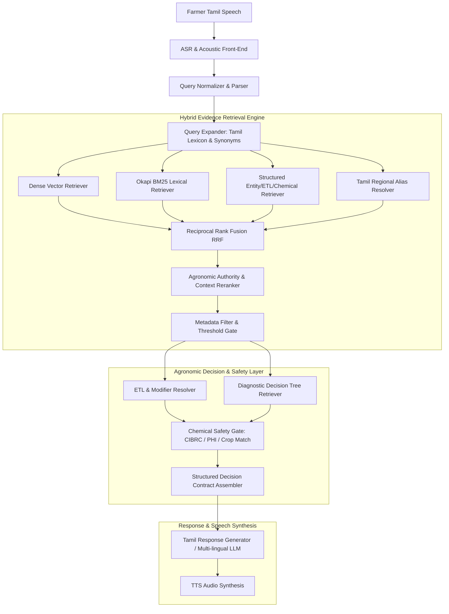

# BHOOMI RAG Architecture Specification

**System Name:** BHOOMI Agricultural Evidence-Grounded Hybrid RAG  
**Component ID:** `rag-core-v1.0`  
**Active Production Knowledge:** `v4.2.0-validated`  
**Candidate Knowledge Staging:** `v4.3.0-candidate`  
**Rollback Snapshot:** `v4.1.0-validated`  

---

## 1. Architectural Dataflow & Component Boundaries

The BHOOMI RAG system enforces strict unidirectional dataflow with hard boundary separation between retrieval, decision logic, regulatory safety, and linguistic generation:

---

## 2. Ingestion & Semantic Chunking Engine

Rather than arbitrary sliding character windows, the ingestion pipeline implements **semantic agricultural evidence chunking**:

| Chunk Type | Granularity | Semantic Purpose | Key Metadata Fields |
|---|---|---|---|
| `ENTITY` | Document / Pest / Disease Level | Canonical taxonomy, lifecycle, host range | `entity_id`, `scientific_name`, `tamil_canonical` |
| `DIAGNOSTIC` | Symptom / Stage Level | Distinguishing field cues, organ symptoms | `affected_part`, `ses_scale`, `cues` |
| `ETL` | Threshold Level | Base economic threshold & sampling unit | `base_value`, `base_unit`, `growth_stage` |
| `MODIFIER` | Context Condition Level | Environmental, natural enemy & virus modifiers | `condition`, `adjusted_value`, `predator_ratio` |
| `SEVERITY` | Tier Level (1–9 SES) | Severity progression from early to spreading | `ses_scale`, `cutoff_range`, `action` |
| `CHEMICAL` | Prescription Level | Active ingredient, formulation, dose, PHI | `cibrc_status`, `phi_days`, `dose_per_ha`, `water_vol` |
| `SAFETY` | Regulatory Boundary | Toxicity label, banned status, buffer zones | `risk_classification`, `drone_allowed`, `buffer_m` |
| `DECISION_TREE`| Multi-Turn Branch | Differential diagnosis nodes & questions | `node_id`, `feature`, `decision_weights` |
| `LEXICON` | Dialect / Alias Level | Regional farmer slang, code-switched phrases | `dialect_region`, `term_type`, `lexicon_status` |

---

## 3. Hybrid Retrieval & Ranking Algorithm

### 3.1 Reciprocal Rank Fusion (RRF)
Queries are dispatched concurrently across Dense Vector, BM25 Lexical, and Structured metadata indexes. RRF scores are computed as:

$$RRF(d) = \sum_{m \in \{dense, bm25, structured, alias\}} \frac{w_m}{k + \text{rank}_m(d)}$$

Where $k = 60$, $w_{dense} = 0.35$, $w_{bm25} = 0.35$, $w_{structured} = 0.20$, and $w_{alias} = 0.10$.

### 3.2 Authority-Weighted Reranking
Retrieved chunks are weighted by institutional provenance authority:
- **Level 10 (Highest)**: CIBRC Official Gazetted Schedules, Central Government Regulatory SOPs ($1.00$).
- **Level 9**: ICAR / ICAR-IIRR Technical Manuals & Standard Evaluation Systems ($0.95$).
- **Level 8**: TNAU Crop Production Guides & Agritech Expert System ($0.90$).
- **Level 7**: State Agricultural University Bulletins & IRRI Knowledge Bank ($0.85$).
- **Level 6**: KVK Extension Survey Results & Field Diagnostic Bulletins ($0.80$).
- **Level 3 (Unverified)**: Farmer raw field notes / anecdotal reports ($0.30$ — permitted only for alias discovery, forbidden for agronomic advice).

---

## 4. Strict Safety Gate Invariants

1. **Restricted Chemical Invariant**: Recommending any molecule tagged `RESTRICTED` (e.g. *Carbofuran 3G*, *Streptocycline*) automatically triggers `CHEMICAL_RECOMMENDATION_BLOCKED` and issues a mandatory safety intervention warning with non-chemical/green-label alternatives.
2. **Crop-Mismatch Isolation**: If the farmer query specifies Crop $A$ (e.g. Brinjal, Chilli) and the retrieved record belongs to Crop $B$ (Rice), the match is hard-rejected (`CROP_MISMATCH_REJECTED`).
3. **Pre-Harvest Interval (PHI) Guardrail**: Late-season sprays requested within the certified PHI window (e.g. Malathion within 7–10 days of harvest) are strictly rejected with an MRL hazard warning.
4. **Conditional ETL Non-Flattening**: Base economic thresholds and contextual modifiers (such as beneficial predator ratios $\ge 1\text{/hill}$ or Tungro endemicity) are never collapsed into a flat average.
5. **No-Hallucination Fallback**: If retrieval relevance falls below the $0.60$ cosine floor, the RAG engine returns `INSUFFICIENT_EVIDENCE` and routes to structured clarification or KVK officer escalation.
